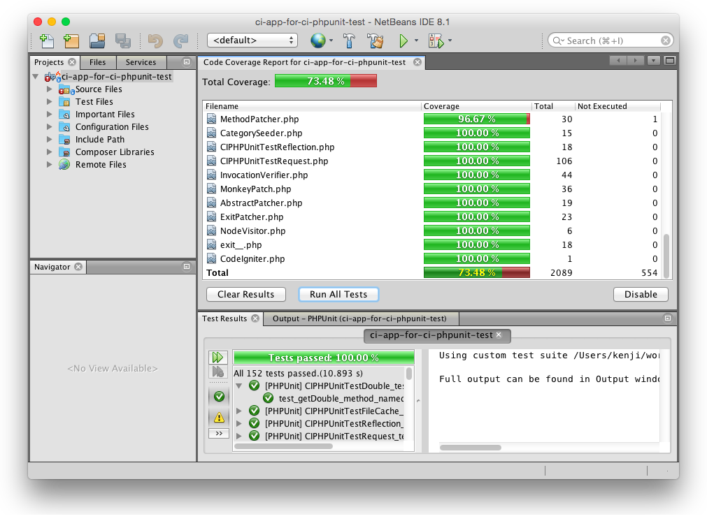

# ci-phpunit-test for CodeIgniter 3.x

   

An easier way to use PHPUnit with [CodeIgniter](https://github.com/bcit-ci/CodeIgniter) 3.x.

* You don't have to modify CodeIgniter core files at all.
* You can write controller tests easily.
* Nothing is untestable, maybe.
* Well documented.

## Requirements

* PHP 7.2 or later
* CodeIgniter 3.x
* PHPUnit 8.1 or later

## Optional

* NetBeans
  * Go to *Project Properties > Testing > PHPUnit*, check *Use Custom Test Suite* checkbox, and select `application/tests/_ci_phpunit_test/TestSuiteProvider.php`.

## Change Log

See [Change Log](https://github.com/kenjis/ci-phpunit-test/blob/2.x/application/tests/_ci_phpunit_test/ChangeLog.md).

## Folder Structure

~~~
codeigniter/
├── application/
│   └── tests/
│        ├── _ci_phpunit_test/ ... don't touch! files ci-phpunit-test uses
│        ├── Bootstrap.php     ... bootstrap file for PHPUnit
│        ├── DbTestCase.php    ... DbTestCase class
│        ├── TestCase.php      ... TestCase class
│        ├── controllers/      ... put your controller tests
│        ├── libraries/        ... put your library tests
│        ├── mocks/
│        │   └── libraries/    ... mock libraries
│        ├── models/           ... put your model tests
│        └── phpunit.xml       ... config file for PHPUnit
└── vendor/
~~~

## Installation

1. Download latest `ci-phpunit-test` from <https://github.com/kenjis/ci-phpunit-test/releases>.
2. Unzip and copy `application/tests` folder into your `application` folder in CodeIgniter project.

That's it.

### Installation via Composer

If you like Composer:

~~~
$ cd /path/to/codeigniter/
$ composer require kenjis/ci-phpunit-test:2.x-dev --dev
~~~

And run `install.php`:

~~~
$ php vendor/kenjis/ci-phpunit-test/install.php
~~~

* The above command always overwrites exisiting files.
* You must run it at CodeIgniter project root folder.
* You can specify your `application` and `public` folder with option arguments, if you use custom folder paths.

~~~
$ php vendor/kenjis/ci-phpunit-test/install.php -a <application_dir> -p <public_dir>
~~~

## Upgrading

1. Download latest `ci-phpunit-test` from <https://github.com/kenjis/ci-phpunit-test/releases>.
2. Unzip and replace `application/tests/_ci_phpunit_test` folder.
3. Read [Change Log](https://github.com/kenjis/ci-phpunit-test/blob/2.x/application/tests/_ci_phpunit_test/ChangeLog.md).

### Upgrading via Composer

If you like Composer:

~~~
$ cd /path/to/codeigniter/
$ composer update kenjis/ci-phpunit-test
$ php vendor/kenjis/ci-phpunit-test/update.php [-a <application_dir> -p <public_dir>]
~~~

Read [Change Log](https://github.com/kenjis/ci-phpunit-test/blob/2.x/application/tests/_ci_phpunit_test/ChangeLog.md).

## How to Run Tests

You have to install PHPUnit before running tests.

**Note:** You must run `phpunit` command in `application/tests` folder.

~~~
$ cd /path/to/codeigniter/
$ cd application/tests/
$ phpunit
PHPUnit 4.8.31 by Sebastian Bergmann and contributors.

...

Time: 341 ms, Memory: 5.50Mb

OK (3 tests, 3 assertions)

Generating code coverage report in Clover XML format ... done

Generating code coverage report in HTML format ... done
~~~

To generate coverage report, Xdebug is needed.

If you want to run a single test case file:

~~~
$ phpunit models/Category_model_test.php
~~~

## How to Write Tests

As an example, a test case class for `Inventory_model` would be as follows:

~~~php
<?php

class Inventory_model_test extends TestCase
{
    public function setUp(): void
    {
        $this->resetInstance();
        $this->CI->load->model('Inventory_model');
        $this->obj = $this->CI->Inventory_model;
    }

    public function test_get_category_list()
    {
        $expected = [
            1 => 'Book',
            2 => 'CD',
            3 => 'DVD',
        ];
        $list = $this->obj->get_category_list();
        foreach ($list as $category) {
            $this->assertEquals($expected[$category->id], $category->name);
        }
    }

    public function test_get_category_name()
    {
        $actual = $this->obj->get_category_name(1);
        $expected = 'Book';
        $this->assertEquals($expected, $actual);
    }
}
~~~

As an example, a test case class for Welcome controller would be as follows:

~~~php
<?php

class Welcome_test extends TestCase
{
    public function test_index()
    {
        $output = $this->request('GET', 'welcome/index');
        $this->assertStringContainsString(
            '<title>Welcome to CodeIgniter</title>', $output
        );
    }
}
~~~

See [How to Write Tests](https://github.com/kenjis/ci-phpunit-test/blob/master/docs/HowToWriteTests.md) for details.

## Function/Class Reference

See [Function and Class Reference](https://github.com/kenjis/ci-phpunit-test/blob/master/docs/FunctionAndClassReference.md).

## Tips

See [Tips](https://github.com/kenjis/ci-phpunit-test/blob/master/docs/Tips.md).

## Related Projects for CodeIgniter 3.x

* [CodeIgniter Composer Installer](https://github.com/kenjis/codeigniter-composer-installer)
* [Cli for CodeIgniter 3.0](https://github.com/kenjis/codeigniter-cli)
* [CodeIgniter Simple and Secure Twig](https://github.com/kenjis/codeigniter-ss-twig)
* [CodeIgniter Doctrine](https://github.com/kenjis/codeigniter-doctrine)
* [CodeIgniter Deployer](https://github.com/kenjis/codeigniter-deployer)
* [CodeIgniter3 Filename Checker](https://github.com/kenjis/codeigniter3-filename-checker)
* [CodeIgniter Widget (View Partial) Sample](https://github.com/kenjis/codeigniter-widgets)
* [CodeIgniter3 Namespaced Controller](https://github.com/kenjis/codeigniter3-namespaced-controller)
